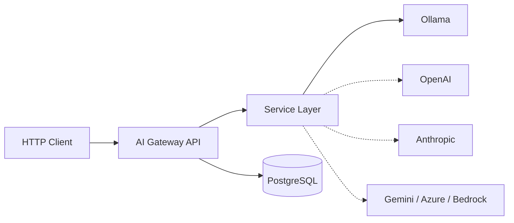
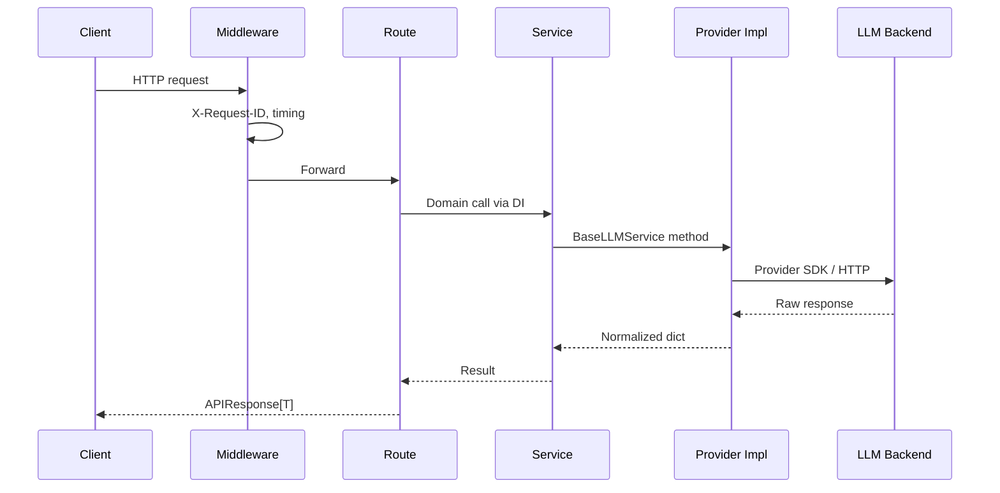

# AI Gateway — Architecture

## Overview

The AI Gateway is a provider-agnostic HTTP API that accepts standardized client requests, routes them to an LLM backend, and returns normalized responses.

It is **infrastructure** — not a chatbot UI and not a coding assistant.



Dashed edges are planned providers (Phase 4+).

---

## Request Flow



---

## Layer Boundaries

| Layer | Path | Responsibility |
|-------|------|----------------|
| Routes | `api/routes/` | HTTP mapping, status codes |
| Dependencies | `api/dependencies.py` | FastAPI DI wiring |
| Services | `services/` | Business logic, provider orchestration |
| Schemas | `schemas/` | Pydantic request/response contracts |
| Models | `models/` | SQLAlchemy ORM entities |
| Core | `core/` | Config, DB engine, logging, lifespan |
| Middleware | `middleware/` | Request ID, response timing |

Routes never import provider SDKs. ORM models never handle HTTP.

---

## Provider Abstraction

All LLM backends implement `BaseLLMService`:

- `chat(message)` — generate a completion
- `check_connection()` — health / latency probe

Current implementation: `OllamaService`.

Adding a provider should require: one service class, config vars, enum entry, and DI registration — no route changes.

---

## Database Layer

### Infrastructure

- Async SQLAlchemy 2.x engine (`core/database.py`)
- `AsyncSessionLocal` + `get_session()` (`core/session.py`)
- PostgreSQL 17 via Docker Compose
- Single metadata registry: `models.base.Base`

### ORM Foundation

- `Base(DeclarativeBase)` — shared MetaData
- `TimestampMixin` — `created_at` / `updated_at` (TIMESTAMPTZ)

### Domain Models (current)

**Capability ownership**

| Layer | Meaning |
|-------|---------|
| `Provider` flags | What the **provider API** supports (streaming, embeddings, vision, function calling, audio) |
| `AIModel` flags | Whether **this specific model** supports a feature (tools, JSON, images, streaming) |

```mermaid
erDiagram
    PROVIDERS ||--o{ AI_MODELS : offers
    PROVIDERS ||--|| PROVIDER_CONFIGURATIONS : has
    AI_MODELS ||--|| AI_MODEL_CONFIGURATIONS : has

    PROVIDERS {
        int id PK
        string name UK
        string display_name
        text description
        string provider_type
        text base_url
        string api_version
        bool is_active
        bool is_local
        bool supports_streaming
        bool supports_embeddings
        bool supports_function_calling
        bool supports_vision
        bool supports_audio
        timestamptz created_at
        timestamptz updated_at
    }

    PROVIDER_CONFIGURATIONS {
        int id PK
        int provider_id FK_UK
        string api_key_env
        text endpoint
        string organization
        string region
        string project
        int timeout_seconds
        int max_retries
        bool verify_ssl
        text proxy_url
        jsonb extra_config
        bool is_active
        timestamptz created_at
        timestamptz updated_at
    }

    AI_MODELS {
        int id PK
        int provider_id FK
        string model_name
        string display_name
        text description
        int context_window
        int max_output_tokens
        bool supports_tools
        bool supports_json
        bool supports_images
        bool supports_streaming
        bool is_default
        bool is_active
        timestamptz created_at
        timestamptz updated_at
    }

    AI_MODEL_CONFIGURATIONS {
        int id PK
        int ai_model_id FK_UK
        float temperature
        float top_p
        int top_k
        float frequency_penalty
        float presence_penalty
        int max_tokens
        int seed
        text system_prompt_template
        bool json_mode_default
        string tool_choice_default
        bool stream_default
        jsonb extra_parameters
        timestamptz created_at
        timestamptz updated_at
    }
```

- One **Provider** → many **AIModel**; one **Provider** → one **ProviderConfiguration**
- One **AIModel** → one **AIModelConfiguration**
- FKs use `ON DELETE CASCADE`; 1:1 sides use unique FK + `uselist=False`
- Unique `(provider_id, model_name)` on `ai_models`
- Relationships use `lazy="selectin"` for async safety
- `api_key_env` stores an environment variable **name**, never the secret value

**Not yet created:** ChatSession, Message, PromptTemplate, APIKey, Alembic migrations, repositories.

---

## API Surface (live)

| Method | Path | Purpose |
|--------|------|---------|
| `GET` | `/` | Service status |
| `GET` | `/health` | Provider connectivity + latency |
| `POST` | `/chat` | Chat completion via configured LLM |

Success envelope: `APIResponse[T]` (`{ success, data }`).
Errors: `{ success: false, error: { code, message } }`.

---

## Backend Structure

```
backend/src/
├── main.py
├── api/
│   ├── dependencies.py
│   └── routes/
│       ├── chat.py
│       └── health.py
├── core/
│   ├── base.py          # re-exports models.Base
│   ├── config.py
│   ├── database.py
│   ├── session.py
│   ├── lifespan.py
│   ├── logging.py
│   ├── exceptions.py
│   ├── handlers.py
│   └── enums.py         # ProviderType, HealthStatus runtime enums
├── middleware/
├── models/
│   ├── base.py
│   ├── mixins.py
│   ├── provider.py
│   ├── provider_configuration.py
│   ├── ai_model.py
│   ├── ai_model_configuration.py
│   └── __init__.py
├── schemas/
└── services/
    ├── base_llm.py
    ├── ollama_service.py
    └── chat_service.py
```

**Naming note:** `src.models.Provider` is the ORM entity. `src.core.enums.ProviderType` is the runtime string enum used in API responses. They are distinct types.

---

## Future Provider Support

| Provider | Status |
|----------|--------|
| Ollama | Implemented (runtime) |
| OpenAI | Planned |
| Anthropic | Planned |
| Gemini | Planned |
| Azure OpenAI | Planned |
| AWS Bedrock | Planned |

Database `providers` / `models` tables are the catalog foundation for multi-provider routing (Phases 4–6).
