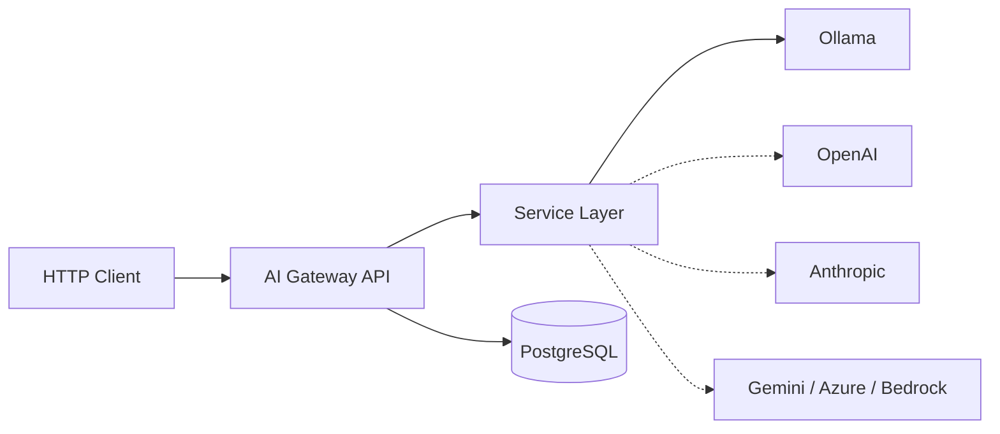
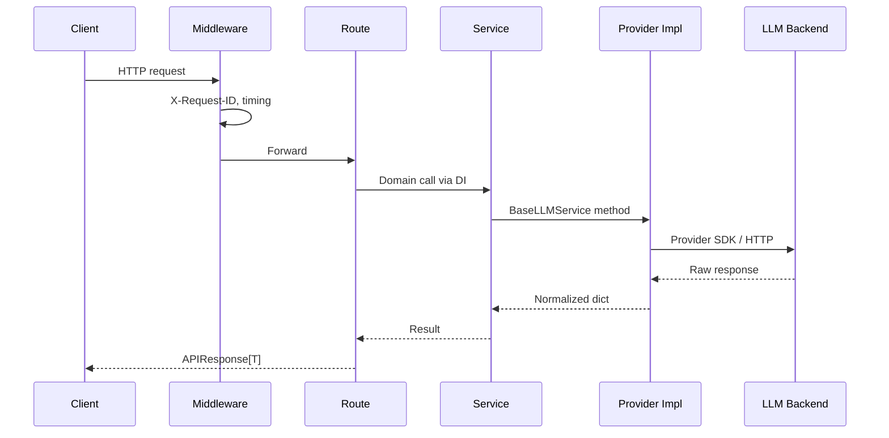
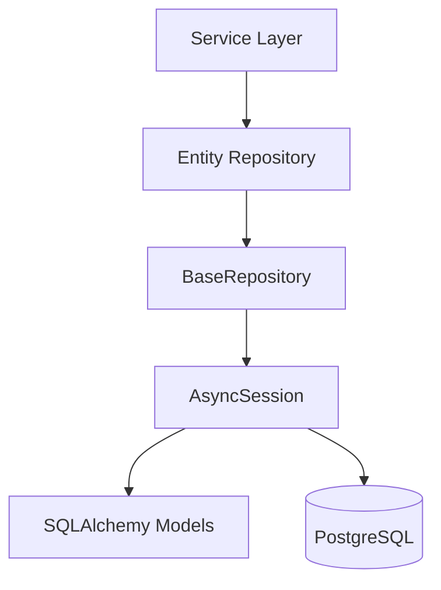
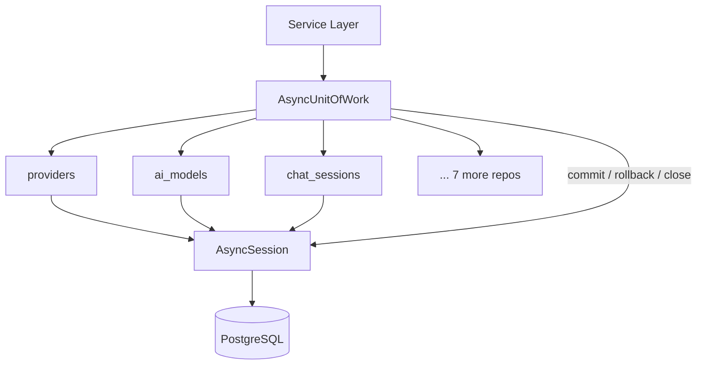

# AI Gateway — Architecture

## Overview

The AI Gateway is a provider-agnostic HTTP API that accepts standardized client requests, routes them to an LLM backend, and returns normalized responses.

It is **infrastructure** — not a chatbot UI and not a coding assistant.



Dashed edges are planned providers (Phase 4+).

---

## Request Flow



---

## Layer Boundaries

| Layer | Path | Responsibility |
|-------|------|----------------|
| Routes | `api/routes/` | HTTP mapping, status codes |
| Dependencies | `api/dependencies.py` | FastAPI DI wiring |
| Services | `services/` | Business logic, provider orchestration |
| Repositories | `repositories/` | Async data access, entity-specific queries |
| Unit of Work | `unit_of_work/` | Transaction coordination, repository registry |
| Schemas | `schemas/` | Pydantic request/response contracts |
| Models | `models/` | SQLAlchemy ORM entities |
| Core | `core/` | Config, DB engine, logging, lifespan |
| Middleware | `middleware/` | Request ID, response timing |

Routes never import provider SDKs. ORM models never handle HTTP.

---

## Provider Abstraction

All LLM backends implement `BaseLLMService`:

- `chat(message)` — generate a completion
- `check_connection()` — health / latency probe

Current implementation: `OllamaService`.

Adding a provider should require: one service class, config vars, enum entry, and DI registration — no route changes.

---

## Database Layer

### Infrastructure

- Async SQLAlchemy 2.x engine (`core/database.py`)
- `AsyncSessionLocal` + `get_session()` (`core/session.py`)
- PostgreSQL 17 via Docker Compose
- Single metadata registry: `models.base.Base`

### ORM Foundation

- `Base(DeclarativeBase)` — shared MetaData
- `TimestampMixin` — `created_at` / `updated_at` (TIMESTAMPTZ)

### Domain Models (current)

**Capability ownership**

| Layer | Meaning |
|-------|---------|
| `Provider` flags | What the **provider API** supports (streaming, embeddings, vision, function calling, audio) |
| `AIModel` flags | Whether **this specific model** supports a feature (tools, JSON, images, streaming) |

```mermaid
erDiagram
    PROVIDERS ||--o{ AI_MODELS : offers
    PROVIDERS ||--|| PROVIDER_CONFIGURATIONS : has
    AI_MODELS ||--|| AI_MODEL_CONFIGURATIONS : has
    PROVIDERS ||--o{ CHAT_SESSIONS : hosts
    AI_MODELS ||--o{ CHAT_SESSIONS : selected_for
    CHAT_SESSIONS ||--o{ MESSAGES : contains
    PROVIDERS ||--o{ API_KEYS : credentials
    PROVIDERS ||--o{ PROVIDER_HEALTH : health_checks
    PROVIDERS ||--o{ USAGE_RECORDS : tracks
    AI_MODELS ||--o{ USAGE_RECORDS : tracks
    CHAT_SESSIONS ||--o{ USAGE_RECORDS : tracks
    PROMPT_TEMPLATES

    API_KEYS {
        int id PK
        int provider_id FK
        string name
        string key_identifier
        string api_key_env
        string organization
        string project
        bool is_default
        bool is_active
        timestamptz expires_at
        timestamptz last_used_at
        timestamptz created_at
        timestamptz updated_at
    }

    USAGE_RECORDS {
        int id PK
        int chat_session_id FK
        int provider_id FK
        int ai_model_id FK
        string request_id
        int prompt_tokens
        int completion_tokens
        int total_tokens
        numeric estimated_cost
        int latency_ms
        string status
        text error_message
        timestamptz request_timestamp
        timestamptz created_at
        timestamptz updated_at
    }

    PROVIDER_HEALTH {
        int id PK
        int provider_id FK
        string status
        int latency_ms
        timestamptz last_success_at
        timestamptz last_failure_at
        text failure_reason
        float health_score
        timestamptz checked_at
        timestamptz created_at
        timestamptz updated_at
    }

    PROVIDERS {
        int id PK
        string name UK
        string display_name
        text description
        string provider_type
        text base_url
        string api_version
        bool is_active
        bool is_local
        bool supports_streaming
        bool supports_embeddings
        bool supports_function_calling
        bool supports_vision
        bool supports_audio
        timestamptz created_at
        timestamptz updated_at
    }

    PROVIDER_CONFIGURATIONS {
        int id PK
        int provider_id FK_UK
        string api_key_env
        text endpoint
        string organization
        string region
        string project
        int timeout_seconds
        int max_retries
        bool verify_ssl
        text proxy_url
        jsonb extra_config
        bool is_active
        timestamptz created_at
        timestamptz updated_at
    }

    AI_MODELS {
        int id PK
        int provider_id FK
        string model_name
        string display_name
        text description
        int context_window
        int max_output_tokens
        bool supports_tools
        bool supports_json
        bool supports_images
        bool supports_streaming
        bool is_default
        bool is_active
        timestamptz created_at
        timestamptz updated_at
    }

    AI_MODEL_CONFIGURATIONS {
        int id PK
        int ai_model_id FK_UK
        float temperature
        float top_p
        int top_k
        float frequency_penalty
        float presence_penalty
        int max_tokens
        int seed
        text system_prompt_template
        bool json_mode_default
        string tool_choice_default
        bool stream_default
        jsonb extra_parameters
        timestamptz created_at
        timestamptz updated_at
    }

    CHAT_SESSIONS {
        int id PK
        uuid session_uuid UK
        int provider_id FK
        int ai_model_id FK
        string title
        text system_prompt
        float temperature_override
        int max_tokens_override
        jsonb metadata
        bool is_archived
        timestamptz created_at
        timestamptz updated_at
    }

    MESSAGES {
        int id PK
        int session_id FK
        string role
        text content
        jsonb metadata
        int token_count
        int latency_ms
        string provider_response_id
        string finish_reason
        timestamptz created_at
        timestamptz updated_at
    }

    PROMPT_TEMPLATES {
        int id PK
        string name
        text description
        text template
        string category
        int version
        jsonb variables
        bool is_active
        timestamptz created_at
        timestamptz updated_at
    }
```

- One **Provider** → many **APIKey**, **ProviderHealth**, **UsageRecord**
- **UsageRecord** optionally links **ChatSession** (`SET NULL` on session delete)
- **UsageRecord** → **Provider** / **AIModel** use `RESTRICT` (preserve billing history)
- **PromptTemplate** is standalone (catalog); unique `(name, version)`
- **APIKey** unique `(provider_id, name)`; secrets via `api_key_env` only
- FKs use `ON DELETE CASCADE` unless noted; 1:1 sides use unique FK + `uselist=False`
- Unique `(provider_id, model_name)` on `ai_models`
- Relationships use `lazy="selectin"` for async safety
- ORM attr `extra_metadata` maps to DB column `metadata` on sessions and messages

**ORM complete (10 tables).** Repository layer (Phase 3.8) and Unit of Work (Phase 3.9) implemented. Next: testing.

### Repository Layer

```
backend/src/repositories/
├── base.py                              # BaseRepository[ModelT] — shared CRUD
├── provider_repository.py
├── ai_model_repository.py
├── provider_configuration_repository.py
├── ai_model_configuration_repository.py
├── chat_session_repository.py
├── message_repository.py
├── prompt_template_repository.py
├── api_key_repository.py
├── usage_record_repository.py
├── provider_health_repository.py
└── __init__.py
```



| Repository | Entity-specific queries |
|------------|-------------------------|
| `ProviderRepository` | `get_by_name`, `list_active` |
| `AIModelRepository` | `get_by_provider_and_name`, `list_enabled_models`, `get_default_model` |
| `ProviderConfigurationRepository` | `get_by_provider_id`, `list_active` |
| `AIModelConfigurationRepository` | `get_by_ai_model_id` |
| `ChatSessionRepository` | `get_by_uuid`, `list_recent_sessions`, `archive_session` |
| `MessageRepository` | `list_messages`, `count_for_session` |
| `PromptTemplateRepository` | `get_by_name_and_version`, `list_active` |
| `APIKeyRepository` | `get_by_provider_and_name`, `get_default_for_provider`, `list_active_for_provider` |
| `UsageRecordRepository` | `get_by_request_id`, `usage_between_dates`, `usage_by_provider` |
| `ProviderHealthRepository` | `latest_health`, `failed_checks`, `list_for_provider` |

**BaseRepository** provides: `create`, `get_by_id`, `get_one`, `list`, `update`, `delete`, `exists`, `count` — with pagination (`offset`/`limit`), filtering, ordering, and optional eager-load `options`.

Repositories flush when needed; commit/rollback belongs to the Unit of Work. See [ADR-012](architecture/ADR-012-repository-pattern.md).

### Unit of Work

```
backend/src/unit_of_work/
├── base.py           # BaseUnitOfWork — ABC + async context manager
├── unit_of_work.py   # AsyncUnitOfWork — concrete implementation
└── __init__.py
```



| Component | Responsibility |
|-----------|----------------|
| `BaseUnitOfWork` | Abstract interface: `commit`, `rollback`, `close`, async context manager |
| `AsyncUnitOfWork` | Registers all 10 repositories on one session; owns transaction lifecycle |

**Repository properties:** `providers`, `ai_models`, `provider_configurations`, `ai_model_configurations`, `chat_sessions`, `messages`, `prompt_templates`, `api_keys`, `usage_records`, `provider_health`.

**Transaction lifecycle:**

```python
async with AsyncUnitOfWork(session) as uow:
    provider = await uow.providers.get_by_name("ollama")
    await uow.commit()  # explicit — never automatic
```

- On exception: rollback, then close
- On normal exit without commit: session close rolls back uncommitted work
- Set `close_session=False` when an outer context owns the session

See [ADR-013](architecture/ADR-013-unit-of-work-pattern.md).

### Testing (Persistence Layer)

```
backend/tests/
├── conftest.py              # PostgreSQL fixtures, Alembic setup, session isolation
├── factories.py             # Entity builders for integration tests
├── helpers.py               # Shared test utilities
└── integration/
    ├── test_alembic.py      # Schema alignment, migration head
    ├── test_orm_models.py   # Constraints, cascades, PostgreSQL types
    ├── test_repositories.py # CRUD + custom queries (all 10 repos)
    └── test_unit_of_work.py # Commit, rollback, context manager
```

| Concern | Strategy |
|---------|----------|
| Database | Separate `TEST_DATABASE_URL` (`ai_coding_assistant_test`) |
| Migrations | Alembic `upgrade head` once per session (subprocess) |
| Isolation | Connection-level transaction rollback per test |
| Committed tests | `committed_session` fixture + `TRUNCATE` cleanup |
| Stack | pytest + pytest-asyncio + asyncpg (PostgreSQL only) |

Run: `cd backend && uv run pytest`

---

## Migrations (Alembic)

Schema changes are managed by Alembic under `backend/alembic/`. Run commands from `backend/`:

```bash
docker compose up -d          # from project root
cd backend
uv run python -m alembic upgrade head
```

### Layout

```
backend/
├── alembic.ini
└── alembic/
    ├── env.py              # async env, Base.metadata, settings.DATABASE_URL
    ├── script.py.mako
    ├── README
    └── versions/
        ├── 20260723_2108_initial_schema.py          # a3f6c2d18e01
        └── 20260723_2200_gateway_operational_models.py  # b7e4d9f21c03
```

### Migrations

| Revision | Description |
|----------|-------------|
| `a3f6c2d18e01` | Initial schema — 7 catalog/conversation tables |
| `b7e4d9f21c03` | Operational models — `api_keys`, `usage_records`, `provider_health` |

Head revision creates **10 application tables** total.

### Common commands

| Command | Purpose |
|---------|---------|
| `uv run python -m alembic upgrade head` | Apply all migrations |
| `uv run python -m alembic downgrade -1` | Roll back one revision |
| `uv run python -m alembic downgrade base` | Drop all application tables |
| `uv run python -m alembic revision --autogenerate -m "msg"` | New migration from model changes |
| `uv run python -m alembic upgrade head --sql` | Preview SQL (offline) |

Requires `.env` with `DATABASE_URL` matching Docker credentials. See [ADR-010](architecture/ADR-010-alembic-async-migrations.md).

---

## API Surface (live)

| Method | Path | Purpose |
|--------|------|---------|
| `GET` | `/` | Service status |
| `GET` | `/health` | Provider connectivity + latency |
| `POST` | `/chat` | Chat completion via configured LLM |

Success envelope: `APIResponse[T]` (`{ success, data }`).
Errors: `{ success: false, error: { code, message } }`.

---

## Backend Structure

```
backend/src/
├── main.py
├── api/
│   ├── dependencies.py
│   └── routes/
│       ├── chat.py
│       └── health.py
├── core/
│   ├── base.py          # re-exports models.Base
│   ├── config.py
│   ├── database.py
│   ├── session.py
│   ├── lifespan.py
│   ├── logging.py
│   ├── exceptions.py
│   ├── handlers.py
│   └── enums.py         # ProviderType, HealthStatus runtime enums
├── middleware/
├── models/
│   └── ...
├── repositories/            # async data access (see Repository Layer)
│   └── ...
├── unit_of_work/              # transaction boundary (see Unit of Work)
│   └── ...
├── tests/                     # persistence integration tests
│   └── ...
├── alembic/                 # migrations (see Migrations section)
├── alembic.ini
├── schemas/
└── services/
    ├── base_llm.py
    ├── ollama_service.py
    └── chat_service.py
```

**Naming note:** `src.models.Provider` is the ORM entity. `src.core.enums.ProviderType` is the runtime string enum used in API responses. They are distinct types.

---

## Future Provider Support

| Provider | Status |
|----------|--------|
| Ollama | Implemented (runtime) |
| OpenAI | Planned |
| Anthropic | Planned |
| Gemini | Planned |
| Azure OpenAI | Planned |
| AWS Bedrock | Planned |

Database `providers` / `models` tables are the catalog foundation for multi-provider routing (Phases 4–6).
