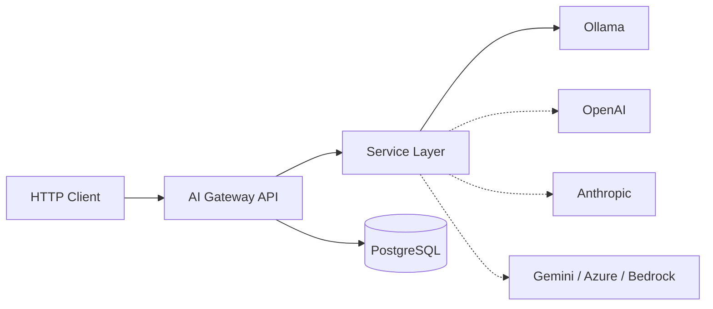
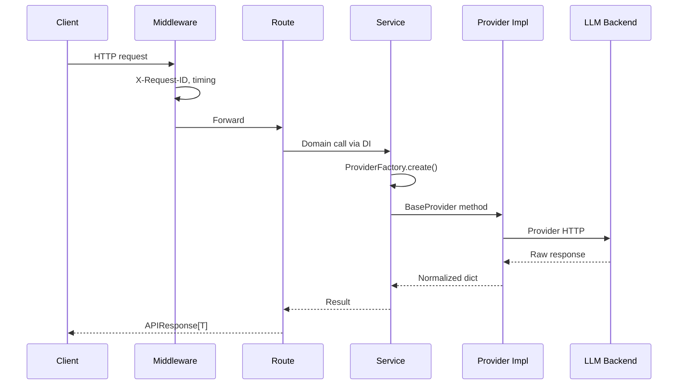
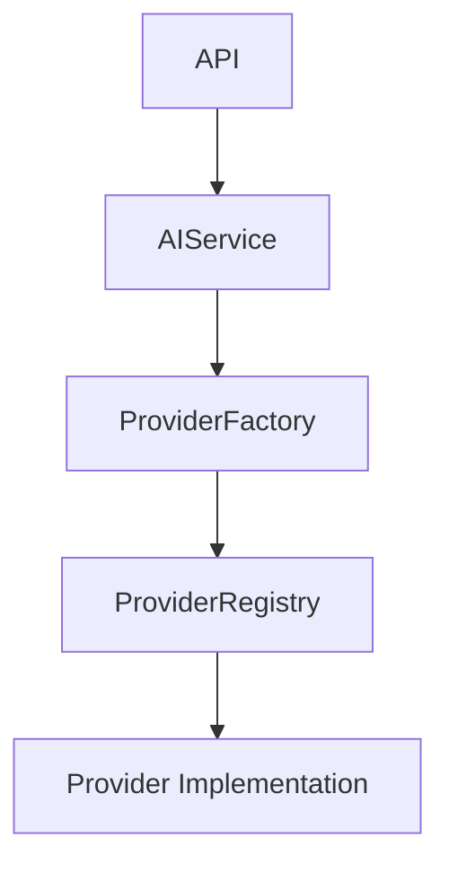
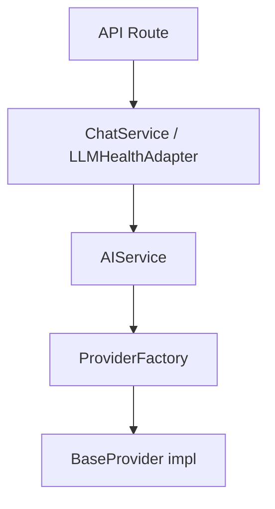
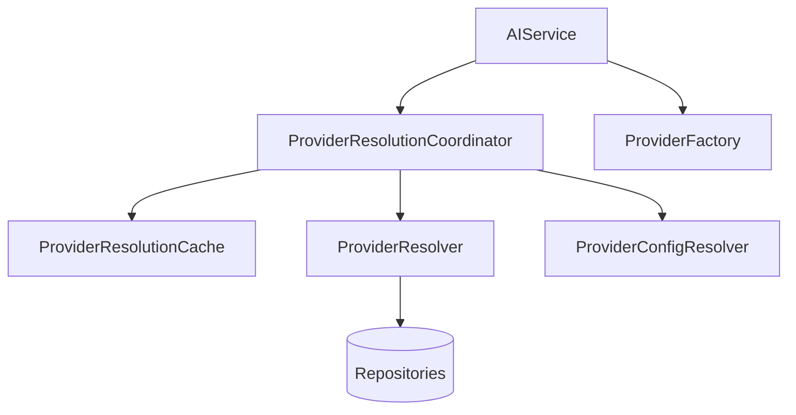
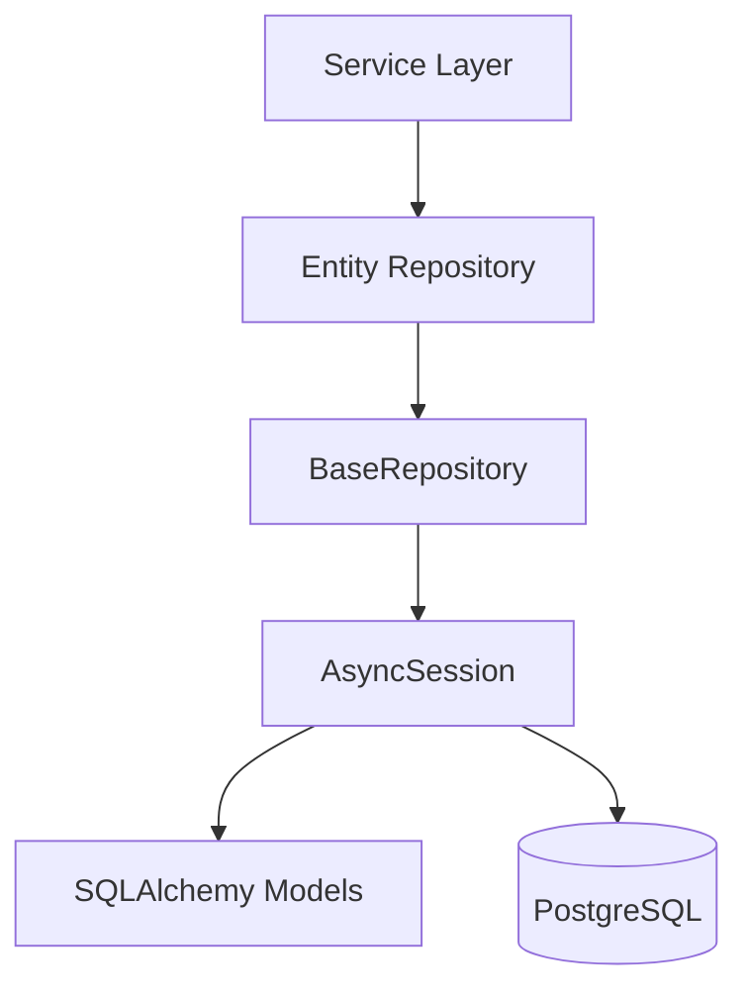
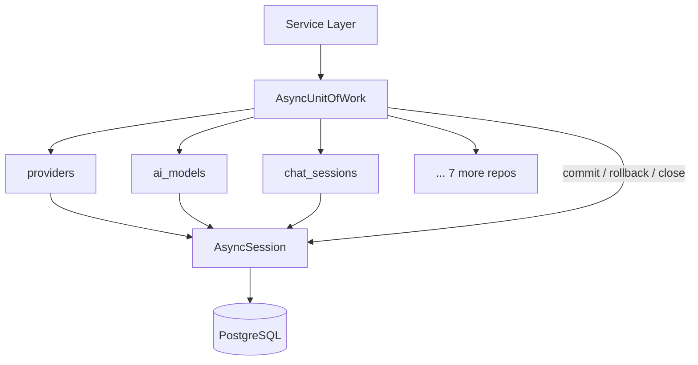

# AI Gateway — Architecture

## Overview

The AI Gateway is a provider-agnostic HTTP API that accepts standardized client requests, routes them to an LLM backend, and returns normalized responses.

It is **infrastructure** — not a chatbot UI and not a coding assistant.


```mermaid
flowchart LR
    Client[HTTP Client] --> Gateway[AI Gateway API]
    Gateway --> Router[Service Layer]
    Router --> Ollama[Ollama]
    Router -.-> OpenAI[OpenAI]
    Router -.-> Anthropic[Anthropic]
    Router -.-> Others[Gemini / Azure / Bedrock]
    Gateway --> DB[(PostgreSQL)]
```

Dashed edges are planned providers (Phase 4+).

---

## Request Flow


```mermaid
sequenceDiagram
    participant C as Client
    participant MW as Middleware
    participant R as Route
    participant S as Service
    participant P as Provider Impl
    participant L as LLM Backend

    C->>MW: HTTP request
    MW->>MW: X-Request-ID, timing
    MW->>R: Forward
    R->>S: Domain call via DI
    S->>S: ProviderFactory.create()
    S->>P: BaseProvider method
    P->>L: Provider HTTP
    L-->>P: Raw response
    P-->>S: Normalized dict
    S-->>R: Result
    R-->>C: APIResponse[T]
```

---

## Layer Boundaries

| Layer | Path | Responsibility |
|-------|------|----------------|
| Routes | `api/routes/` | HTTP mapping, status codes |
| Dependencies | `api/dependencies.py` | FastAPI DI wiring |
| Services | `services/` | Business logic, provider orchestration |
| Providers | `providers/` | Vendor-neutral LLM adapter contracts (Phase 4) |
| Repositories | `repositories/` | Async data access, entity-specific queries |
| Unit of Work | `unit_of_work/` | Transaction coordination, repository registry |
| Schemas | `schemas/` | Pydantic request/response contracts |
| Models | `models/` | SQLAlchemy ORM entities |
| Core | `core/` | Config, DB engine, logging, lifespan |
| Middleware | `middleware/` | Request ID, response timing |

Routes never import provider SDKs. ORM models never handle HTTP.

---

## Provider Abstraction (Phase 4)

Vendor-specific SDK/HTTP logic lives behind `BaseProvider` in `backend/src/providers/`:

```
backend/src/providers/
├── base.py         # BaseProvider ABC + normalized request/response DTOs
├── exceptions.py   # ProviderError hierarchy
├── registry.py     # ProviderRegistry + register_provider helper
├── factory.py      # ProviderFactory (on-demand instantiation)
├── ollama.py       # OllamaProvider REST adapter (Phase 4.3)
├── openai.py       # OpenAIProvider REST adapter (Phase 5)
├── anthropic.py    # AnthropicProvider REST adapter (Phase 5)
├── gemini.py       # GeminiProvider REST adapter (Phase 5)
├── http_mixin.py   # HTTPProviderMixin shared lifecycle (Phase 4.6)
├── http_errors.py  # HTTPErrorMapper (Phase 5)
├── http_auth.py    # Auth header builders (Phase 5)
├── retry.py        # Async retry helper (Phase 5)
├── streaming.py    # SSE / NDJSON parsers (Phase 5)
├── validation.py   # ModelListCache (Phase 5)
└── __init__.py
```

| Method | Purpose |
|--------|---------|
| `chat(request)` | Non-streaming completion |
| `stream_chat(request)` | Streaming completion chunks |
| `embeddings(request)` | Vector embeddings |
| `list_models()` | Available model catalog |
| `health_check()` | Connectivity probe |

### Registry and factory (Phase 4.2)

Provider **classes** are registered at import time; the factory creates a **fresh instance** per request or service call.


```mermaid
flowchart TD
    API[API]
    AIService[AIService]
    Factory[ProviderFactory]
    Registry[ProviderRegistry]
    Impl[Provider Implementation]

    API --> AIService
    AIService --> Factory
    Factory --> Registry
    Registry --> Impl
```

| Component | Responsibility |
|-----------|----------------|
| `ProviderRegistry` | Thread-safe map of `provider_name` → provider class |
| `register_provider()` | Convenience helper; forwards to the default registry |
| `ProviderFactory` | Resolves class from registry and constructs instance with `**kwargs` |

Future provider modules call `register_provider(...)` at import time so the registry is populated without central edits.

### Ollama adapter (Phase 4.3)

`OllamaProvider` is the first concrete implementation. It uses `httpx.AsyncClient` against Ollama's REST API and self-registers on import.

| Ollama endpoint | Provider method |
|-----------------|-----------------|
| `GET /api/tags` | `health_check()`, `list_models()` |
| `POST /api/chat` | `chat()`, `stream_chat()` |
| `POST /api/embeddings` | `embeddings()` |

**HTTP lifecycle:** The provider accepts an optional injected `httpx.AsyncClient`. When none is supplied, it creates one scoped to `base_url` and closes it in `close()` / `__aexit__`. Injected clients are never closed by the provider.

**Streaming:** Non-buffered NDJSON via `client.stream()` and `aiter_lines()`; each parsed line yields a `ChatStreamChunk`.

**Error mapping:** Connection/timeout → `ProviderUnavailableError`; 404 → `ModelNotFoundError`; 400 → `InvalidRequestError`; 401/403 → `AuthenticationError`; 429 → `RateLimitError`.

See [ADR-014](architecture/ADR-014-ollama-provider.md).

### Service integration (Phase 4.4)

`AIService` is the provider-agnostic orchestration layer. Routes still call `ChatService` and `LLMHealthAdapter`; both delegate to `AIService`, which:

1. Resolves provider (`settings.DEFAULT_PROVIDER` or caller override)
2. Resolves model (`settings.DEFAULT_MODEL` or caller override)
3. Creates a provider via `ProviderFactory`
4. Executes the operation through `BaseProvider`
5. Maps DTOs to legacy route payloads and `ProviderError` to service exceptions


```mermaid
flowchart TD
    Route[API Route]
    ChatSvc[ChatService / LLMHealthAdapter]
    AI[AIService]
    Factory[ProviderFactory]
    Provider[BaseProvider impl]

    Route --> ChatSvc
    ChatSvc --> AI
    AI --> Factory
    Factory --> Provider
```

Provider lifecycle is scoped per request: `async with provider` when supported, otherwise explicit `close()` in `finally`.

### Database-backed resolution (Phase 4.5)

Provider and model selection no longer rely on settings alone. `ProviderResolver` applies this precedence:

| Priority | Provider | Model |
|----------|----------|-------|
| 1 | Request override | Request override |
| 2 | Database default provider | Database default model (for selected provider) |
| 3 | `settings.DEFAULT_PROVIDER` | `settings.DEFAULT_MODEL` |
| 4 | Hardcoded `"ollama"` | — |

`ProviderConfigResolver` builds factory kwargs from `Provider`, `ProviderConfiguration`, and `APIKey` rows (endpoint, timeout, env-var API key references). Results are cached in memory for `PROVIDER_RESOLUTION_CACHE_TTL_SECONDS` (default 60s). **Provider instances are never cached.**


```mermaid
flowchart TD
    AI[AIService]
    Coord[ProviderResolutionCoordinator]
    Cache[ProviderResolutionCache]
    Res[ProviderResolver]
    Config[ProviderConfigResolver]
    Repos[(Repositories)]
    Factory[ProviderFactory]

    AI --> Coord
    Coord --> Cache
    Coord --> Res
    Coord --> Config
    Res --> Repos
    AI --> Factory
```

See [ADR-015](architecture/ADR-015-provider-service-integration.md) and [ADR-016](architecture/ADR-016-provider-resolution.md).

### Cloud provider adapters (Phase 5)

All four registered providers implement the full `BaseProvider` contract via httpx REST:

| Provider | Registry key | Primary API | Embeddings |
|----------|--------------|-------------|------------|
| Ollama | `ollama` | `/api/chat` | Yes |
| OpenAI | `openai` | `/v1/chat/completions` | Yes |
| Anthropic | `anthropic` | `/v1/messages` | No |
| Gemini | `gemini` | `/v1beta/models/{model}:generateContent` | Yes |

Shared infrastructure: `HTTPErrorMapper`, `retry_async`, `iter_sse_json` / `iter_sse_events`, `ModelListCache`, auth header builders in `http_auth.py`.

Extended DTOs support multimodal `parts`, tools, structured JSON, and provider-specific options (e.g., Gemini `safetySettings`).

`ProviderConfigResolver` includes dedicated builders for `anthropic` (API version header) and `gemini`.

`ProviderType` enum: `ollama`, `openai`, `anthropic`, `gemini`.

See [ADR-018](architecture/ADR-018-extended-provider-dtos.md) and [ADR-019](architecture/ADR-019-cloud-provider-implementations.md). Per-vendor configuration: `docs/providers/`.

### Provider skeletons (Phase 4.6 — superseded by Phase 5)

OpenAI, Anthropic, and Gemini were initially registered as skeletons (Phase 4.6). Phase 5 replaced skeleton method bodies with full REST implementations while preserving registry keys and `HTTPProviderMixin` lifecycle.

See [ADR-017](architecture/ADR-017-provider-skeletons.md).

---

## Database Layer

### Infrastructure

- Async SQLAlchemy 2.x engine (`core/database.py`)
- `AsyncSessionLocal` + `get_session()` (`core/session.py`)
- PostgreSQL 17 via Docker Compose
- Single metadata registry: `models.base.Base`

### ORM Foundation

- `Base(DeclarativeBase)` — shared MetaData
- `TimestampMixin` — `created_at` / `updated_at` (TIMESTAMPTZ)

### Domain Models (current)

**Capability ownership**

| Layer | Meaning |
|-------|---------|
| `Provider` flags | What the **provider API** supports (streaming, embeddings, vision, function calling, audio) |
| `AIModel` flags | Whether **this specific model** supports a feature (tools, JSON, images, streaming) |

```mermaid
erDiagram
    PROVIDERS ||--o{ AI_MODELS : offers
    PROVIDERS ||--|| PROVIDER_CONFIGURATIONS : has
    AI_MODELS ||--|| AI_MODEL_CONFIGURATIONS : has
    PROVIDERS ||--o{ CHAT_SESSIONS : hosts
    AI_MODELS ||--o{ CHAT_SESSIONS : selected_for
    CHAT_SESSIONS ||--o{ MESSAGES : contains
    PROVIDERS ||--o{ API_KEYS : credentials
    PROVIDERS ||--o{ PROVIDER_HEALTH : health_checks
    PROVIDERS ||--o{ USAGE_RECORDS : tracks
    AI_MODELS ||--o{ USAGE_RECORDS : tracks
    CHAT_SESSIONS ||--o{ USAGE_RECORDS : tracks
    PROMPT_TEMPLATES

    API_KEYS {
        int id PK
        int provider_id FK
        string name
        string key_identifier
        string api_key_env
        string organization
        string project
        bool is_default
        bool is_active
        timestamptz expires_at
        timestamptz last_used_at
        timestamptz created_at
        timestamptz updated_at
    }

    USAGE_RECORDS {
        int id PK
        int chat_session_id FK
        int provider_id FK
        int ai_model_id FK
        string request_id
        int prompt_tokens
        int completion_tokens
        int total_tokens
        numeric estimated_cost
        int latency_ms
        string status
        text error_message
        timestamptz request_timestamp
        timestamptz created_at
        timestamptz updated_at
    }

    PROVIDER_HEALTH {
        int id PK
        int provider_id FK
        string status
        int latency_ms
        timestamptz last_success_at
        timestamptz last_failure_at
        text failure_reason
        float health_score
        timestamptz checked_at
        timestamptz created_at
        timestamptz updated_at
    }

    PROVIDERS {
        int id PK
        string name UK
        string display_name
        text description
        string provider_type
        text base_url
        string api_version
        bool is_active
        bool is_local
        bool supports_streaming
        bool supports_embeddings
        bool supports_function_calling
        bool supports_vision
        bool supports_audio
        timestamptz created_at
        timestamptz updated_at
    }

    PROVIDER_CONFIGURATIONS {
        int id PK
        int provider_id FK_UK
        string api_key_env
        text endpoint
        string organization
        string region
        string project
        int timeout_seconds
        int max_retries
        bool verify_ssl
        text proxy_url
        jsonb extra_config
        bool is_active
        timestamptz created_at
        timestamptz updated_at
    }

    AI_MODELS {
        int id PK
        int provider_id FK
        string model_name
        string display_name
        text description
        int context_window
        int max_output_tokens
        bool supports_tools
        bool supports_json
        bool supports_images
        bool supports_streaming
        bool is_default
        bool is_active
        timestamptz created_at
        timestamptz updated_at
    }

    AI_MODEL_CONFIGURATIONS {
        int id PK
        int ai_model_id FK_UK
        float temperature
        float top_p
        int top_k
        float frequency_penalty
        float presence_penalty
        int max_tokens
        int seed
        text system_prompt_template
        bool json_mode_default
        string tool_choice_default
        bool stream_default
        jsonb extra_parameters
        timestamptz created_at
        timestamptz updated_at
    }

    CHAT_SESSIONS {
        int id PK
        uuid session_uuid UK
        int provider_id FK
        int ai_model_id FK
        string title
        text system_prompt
        float temperature_override
        int max_tokens_override
        jsonb metadata
        bool is_archived
        timestamptz created_at
        timestamptz updated_at
    }

    MESSAGES {
        int id PK
        int session_id FK
        string role
        text content
        jsonb metadata
        int token_count
        int latency_ms
        string provider_response_id
        string finish_reason
        timestamptz created_at
        timestamptz updated_at
    }

    PROMPT_TEMPLATES {
        int id PK
        string name
        text description
        text template
        string category
        int version
        jsonb variables
        bool is_active
        timestamptz created_at
        timestamptz updated_at
    }
```

- One **Provider** → many **APIKey**, **ProviderHealth**, **UsageRecord**
- **UsageRecord** optionally links **ChatSession** (`SET NULL` on session delete)
- **UsageRecord** → **Provider** / **AIModel** use `RESTRICT` (preserve billing history)
- **PromptTemplate** is standalone (catalog); unique `(name, version)`
- **APIKey** unique `(provider_id, name)`; one default key per provider (partial unique index); secrets via `api_key_env` only
- **UsageRecord** unique `request_id`; billing audit with RESTRICT on provider/model delete
- FKs use `ON DELETE CASCADE` unless noted; 1:1 sides use unique FK + `uselist=False`
- Unique `(provider_id, model_name)` on `ai_models`; one default model per provider (partial unique index)
- Relationships use `lazy="selectin"` for async safety
- ORM attr `extra_metadata` maps to DB column `metadata` on sessions and messages

**Phase 3 complete (10 tables).** Repository layer, Unit of Work, integration tests, and schema hardening are in place. Next: Phase 4 — Multi-Provider Architecture.

### Repository Layer

```
backend/src/repositories/
├── base.py                              # BaseRepository[ModelT] — shared CRUD
├── provider_repository.py
├── ai_model_repository.py
├── provider_configuration_repository.py
├── ai_model_configuration_repository.py
├── chat_session_repository.py
├── message_repository.py
├── prompt_template_repository.py
├── api_key_repository.py
├── usage_record_repository.py
├── provider_health_repository.py
└── __init__.py
```


```mermaid
flowchart TB
    Service[Service Layer] --> Repo[Entity Repository]
    Repo --> Base[BaseRepository]
    Base --> Session[AsyncSession]
    Session --> ORM[SQLAlchemy Models]
    Session --> PG[(PostgreSQL)]
```

| Repository | Entity-specific queries |
|------------|-------------------------|
| `ProviderRepository` | `get_by_name`, `list_active` |
| `AIModelRepository` | `get_by_provider_and_name`, `list_enabled_models`, `get_default_model` |
| `ProviderConfigurationRepository` | `get_by_provider_id`, `list_active` |
| `AIModelConfigurationRepository` | `get_by_ai_model_id` |
| `ChatSessionRepository` | `get_by_uuid`, `list_recent_sessions`, `archive_session` |
| `MessageRepository` | `list_messages`, `count_for_session` |
| `PromptTemplateRepository` | `get_by_name_and_version`, `list_active` |
| `APIKeyRepository` | `get_by_provider_and_name`, `get_default_for_provider`, `list_active_for_provider` |
| `UsageRecordRepository` | `get_by_request_id`, `usage_between_dates`, `usage_by_provider` |
| `ProviderHealthRepository` | `latest_health`, `failed_checks`, `list_for_provider` |

**BaseRepository** provides: `create`, `get_by_id`, `get_one`, `list`, `update`, `delete`, `exists`, `count` — with pagination (`offset`/`limit`), filtering, ordering, and optional eager-load `options`.

Repositories flush when needed; commit/rollback belongs to the Unit of Work. See [ADR-012](architecture/ADR-012-repository-pattern.md).

### Unit of Work

```
backend/src/unit_of_work/
├── base.py           # BaseUnitOfWork — ABC + async context manager
├── unit_of_work.py   # AsyncUnitOfWork — concrete implementation
└── __init__.py
```


```mermaid
flowchart TB
    Service[Service Layer] --> UoW[AsyncUnitOfWork]
    UoW --> PR[providers]
    UoW --> AM[ai_models]
    UoW --> CS[chat_sessions]
    UoW --> Other[... 7 more repos]
    PR --> Session[AsyncSession]
    AM --> Session
    CS --> Session
    Session --> PG[(PostgreSQL)]
    UoW -->|commit / rollback / close| Session
```

| Component | Responsibility |
|-----------|----------------|
| `BaseUnitOfWork` | Abstract interface: `commit`, `rollback`, `close`, async context manager |
| `AsyncUnitOfWork` | Registers all 10 repositories on one session; owns transaction lifecycle |

**Repository properties:** `providers`, `ai_models`, `provider_configurations`, `ai_model_configurations`, `chat_sessions`, `messages`, `prompt_templates`, `api_keys`, `usage_records`, `provider_health`.

**Transaction lifecycle:**

```python
async with AsyncUnitOfWork(session) as uow:
    provider = await uow.providers.get_by_name("ollama")
    await uow.commit()  # explicit — never automatic
```

- On exception: rollback, then close
- On normal exit without commit: session close rolls back uncommitted work
- Set `close_session=False` when an outer context owns the session

See [ADR-013](architecture/ADR-013-unit-of-work-pattern.md).

### Testing (Persistence Layer)

```
backend/tests/
├── conftest.py              # PostgreSQL fixtures, Alembic setup, session isolation
├── factories.py             # Entity builders for integration tests
├── helpers.py               # Shared test utilities
└── integration/
    ├── test_alembic.py      # Schema alignment, migration head
    ├── test_orm_models.py   # Constraints, cascades, PostgreSQL types
    ├── test_repositories.py # CRUD + custom queries (all 10 repos)
    └── test_unit_of_work.py # Commit, rollback, context manager
```

| Concern | Strategy |
|---------|----------|
| Database | Separate `TEST_DATABASE_URL` (`ai_coding_assistant_test`) |
| Migrations | Alembic `upgrade head` once per session (subprocess) |
| Isolation | Connection-level transaction rollback per test |
| Committed tests | `committed_session` fixture + `TRUNCATE` cleanup |
| Stack | pytest + pytest-asyncio + asyncpg (PostgreSQL only) |

Run: `cd backend && uv run pytest`

---

## Migrations (Alembic)

Schema changes are managed by Alembic under `backend/alembic/`. Run commands from `backend/`:

```bash
docker compose up -d          # from project root
cd backend
uv run python -m alembic upgrade head
```

### Layout

```
backend/
├── alembic.ini
└── alembic/
    ├── env.py              # async env, Base.metadata, settings.DATABASE_URL
    ├── script.py.mako
    ├── README
    └── versions/
        ├── 20260723_2108_initial_schema.py          # a3f6c2d18e01
        ├── 20260723_2200_gateway_operational_models.py  # b7e4d9f21c03
        └── 20260723_2345_phase3_hardening_constraints.py  # c8f5e2a31d04
```

### Migrations

| Revision | Description |
|----------|-------------|
| `a3f6c2d18e01` | Initial schema — 7 catalog/conversation tables |
| `b7e4d9f21c03` | Operational models — `api_keys`, `usage_records`, `provider_health` |
| `c8f5e2a31d04` | Hardening — unique `request_id`, one default model/key per provider |

Head revision creates **10 application tables** total.

### Common commands

| Command | Purpose |
|---------|---------|
| `uv run python -m alembic upgrade head` | Apply all migrations |
| `uv run python -m alembic downgrade -1` | Roll back one revision |
| `uv run python -m alembic downgrade base` | Drop all application tables |
| `uv run python -m alembic revision --autogenerate -m "msg"` | New migration from model changes |
| `uv run python -m alembic upgrade head --sql` | Preview SQL (offline) |

Requires `.env` with `DATABASE_URL` matching Docker credentials. See [ADR-010](architecture/ADR-010-alembic-async-migrations.md).

---

## API Surface (live)

| Method | Path | Purpose |
|--------|------|---------|
| `GET` | `/` | Service status |
| `GET` | `/health` | Provider connectivity + latency |
| `POST` | `/chat` | Chat completion via configured LLM |

Success envelope: `APIResponse[T]` (`{ success, data }`).
Errors: `{ success: false, error: { code, message } }`.

---

## Backend Structure

```
backend/src/
├── main.py
├── api/
│   ├── dependencies.py
│   └── routes/
│       ├── chat.py
│       └── health.py
├── core/
│   ├── base.py          # re-exports models.Base
│   ├── config.py
│   ├── database.py
│   ├── session.py
│   ├── lifespan.py
│   ├── logging.py
│   ├── exceptions.py
│   ├── handlers.py
│   └── enums.py         # ProviderType, HealthStatus runtime enums
├── middleware/
├── models/
│   └── ...
├── repositories/            # async data access (see Repository Layer)
│   └── ...
├── unit_of_work/              # transaction boundary (see Unit of Work)
│   └── ...
├── tests/                     # persistence integration tests
│   └── ...
├── alembic/                 # migrations (see Migrations section)
├── alembic.ini
├── schemas/
├── providers/               # vendor-neutral LLM adapters (Phase 4)
│   └── ...
└── services/
    ├── ai_service.py
    ├── provider_resolver.py
    ├── provider_config_resolver.py
    ├── provider_resolution_coordinator.py
    ├── resolution_types.py
    ├── chat_service.py
    ├── llm_adapter.py
    ├── base_llm.py
    └── ollama_service.py        # legacy; not wired to routes
```

**Naming note:** `src.models.Provider` is the ORM entity. `src.core.enums.ProviderType` is the runtime string enum used in API responses. They are distinct types.

---

## Future Provider Support

| Provider | Status |
|----------|--------|
| Ollama | Implemented |
| OpenAI | Skeleton (registered) |
| Anthropic | Skeleton (registered) |
| Gemini | Skeleton (registered) |
| Azure OpenAI | Planned |
| AWS Bedrock | Planned |

Database `providers` / `models` tables are the catalog foundation for multi-provider routing (Phases 4–6).
